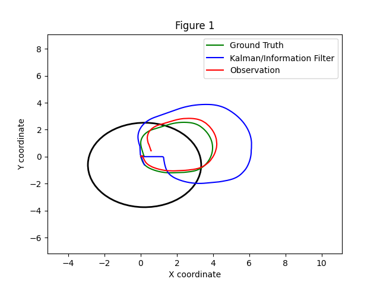

# Práctica 3: Filtro de Kalman Extendido (EKF) en ROS 2

## Objetivos

En esta práctica implementaremos un **Filtro de Kalman Extendido (EKF)** para estimar el estado de un robot móvil en movimiento, utilizando distintos modelos de movimiento y observación. El robot cuenta con odometría y una IMU simuladas, y aplicaremos técnicas de fusión sensorial para mejorar la estimación. La odometría será usada como ground truth (referencia) y le añadiremos ruido para simular condiciones reales.

---

## Procedimiento

Se han rellenado todos los apartados TODO en los diferentes archivos, y se ha comprobado su funcionamiento correcto y se han realizado diferentes pruebas cambiando las incertidumbres en la observacion y en el movimiento. 

---

## Resultados 

Una vez realizados los cambios, se han realizados los diferentes experimentos mencionados. Se han probado los 3 modelos, el de 3 dimensiones, el de 7 y el de 8, cada uno en 3 diferentes situaciones, la primera con la configuración de la incertidumbre inicial, otra con una incertidumbre de observación elevada, y otra con una incertidumbre en el modelo de movimiento. Todas las pruebas se han realizado usando un rosbag proporcionado para realizar una trayectoria circular. 

Para aumentar la incertidumbre de la observación, se ha aumentado el valor _obs_noise_std_, multiplicando su valor por 5. Además, para aumentar la incertidumbre en el modelo de movimiento se ha aumentado el valor proc_noise_std 10 veces. 

### Modelo 3D

Primero se hacen las simulaciones con el modelo 3D  (x, y, θ), el modelo más básico. 

- Caso base
  
  
  
- Caso con alta incertidumbre en la observacion

  

- Caso con alta incertidumbre en el modelo de movimiento

  

### Modelo 7D

A continuación se realizan con el modelo 7D  (x, y, θ, v, ω, ax, ay), que nos permite una mayor precisión, a cambio de coste computacional

- Caso base
  
  

- Caso con alta incertidumbre en la observacion
  
  

- Caso con alta incertidumbre en el modelo de movimiento
  
  

### Modelo 8D

Por último se realizan con el modelo 8D (x, y, θ, vx, vy, ω, ax, ay), que nos permite una precisión aún mayor, pero con un coste computacional todavía más elevado. 

- Caso base
  
  

- Caso con alta incertidumbre en la observacion

  

- Caso con alta incertidumbre en el modelo de movimiento

  

### Evaluación de resultados 

Se puede observar como en los casos en los que la incertidumbre de la observación es muy elevada el filtro confía más en el modelo de movimiento, ignorando las correcciones de los sensores, lo que empeora las estimaciones. A su vez, en los casos de alta incertidumbre en el modelo de movimiento, confía mucho más en la observación, haciendo que la estimación se base casi en su totalidad en la observación.  

---

## Conclusión 

En conclusión, se ha podido determinar que el filtro EKF permite estimar el modelo del robot móvil de forma correcta, siempre que se configuren de forma correcta las incertidumbres del sistema. 
